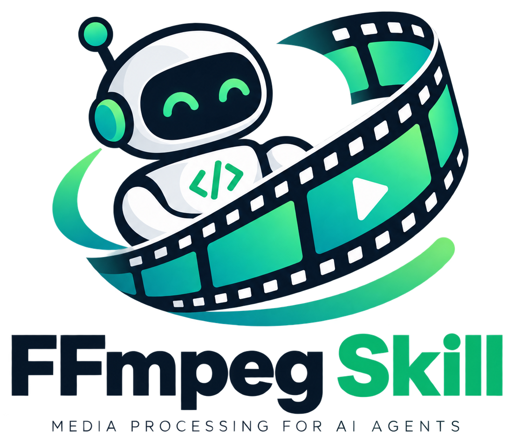
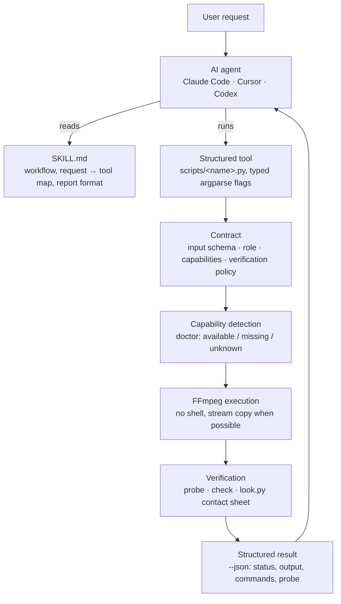
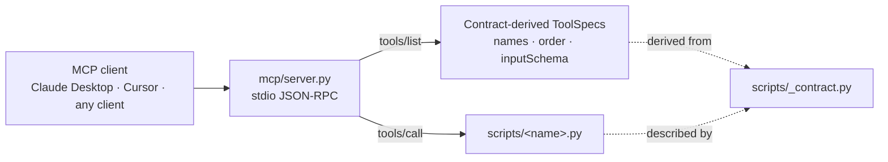

<p align="center">
  
</p>

<h1 align="center">ffmpeg-skill</h1>

<p align="center"><strong>Give your coding agent a video editor.</strong></p>

<p align="center">
  Local FFmpeg · No cloud · No API keys · Python standard library<br>
  Claude Code · Cursor · Codex · MCP
</p>

<p align="center">
  <a href="https://github.com/kajisho5/ffmpeg-skill/actions/workflows/ci.yml"></a>
  <a href="https://www.npmjs.com/package/ffmpeg-skill"></a>
  
  
  <a href="LICENSE"></a>
</p>

```bash
npx ffmpeg-skill
```


`ffmpeg-skill` is an [Agent Skill](https://docs.anthropic.com/en/docs/agents-and-tools/agent-skills) for Claude Code, Cursor, Codex and any agent that reads `SKILL.md`. It teaches the agent a fixed workflow (probe → edit losslessly where possible → check → verify) and ships **21 tools** that do the actual work with `ffmpeg` / `ffprobe`: cut, join, silence removal, fit to duration and aspect, captions and karaoke, overlays and motion graphics, HDR → SDR and LUTs, audio clean-up and typed dynamics, sync with drift correction, multicam, loudness, delivery checks, whole-edit project rendering, batch folders. Every tool is also an MCP tool, and the whole set is described by a machine-readable contract.

If `ffmpeg` and `python3` are on your PATH, it works: offline, on footage you would rather not upload.

---

**Contents**
[Why](#why) · [Quick start](#quick-start) · [How it works](#how-it-works) · [Design principles](#design-principles) · [Tools](#tools) · [Audio](#audio-is-a-first-class-input) · [Built for agents](#built-for-agents) · [FFmpeg compatibility](#ffmpeg-compatibility) · [Tested on real footage](#tested-on-real-footage) · [Install](#install) · [Requirements](#requirements) · [Development](#development) · [Docs](#docs)

---

## Why

An agent that "knows FFmpeg" still guesses: it assumes a frame rate, picks a codec the container cannot hold, re-encodes a file that only needed a stream copy, and reports "done" without opening the result. ffmpeg-skill exists to take the guessing out:

- **Real files first.** Every job starts with `probe.py`; the agent decides from the measured duration, fps, resolution, colour and audio layout, not from the file name.
- **Structured tools, not shell strings.** Each operation is a script with typed arguments. Nothing runs through a shell; no filter graph is accepted from the caller.
- **A contract the agent can read.** `contract --json` states, for every tool, what it takes, what it writes, which FFmpeg components it needs and how the result is verified. The MCP surface is derived from it.
- **Verification after execution.** The result is probed, checked against the destination's spec and, when the picture changed, looked at as a contact sheet.
- **Local first.** No cloud, no API keys, no Python dependencies. Optional local transcription is used when a whisper is installed, never required.

## Quick start

```bash
# 1. install the skill for Claude Code (Cursor: --cursor, Codex: --codex, all three: --all)
npx ffmpeg-skill

# 2. check the machine: ffmpeg, ffprobe and every FFmpeg component the tools need
npx ffmpeg-skill doctor

# 3. (for agent frameworks) read the machine-readable contract
npx ffmpeg-skill contract --json | head -40
```

Then talk to your agent:

> "Take `interview.mp4`, keep 0:45–3:10 and 5:00–6:30, and make it exactly 60 seconds for Reels."

The agent runs `probe.py`, `cut.py --segments 0:45-3:10,5:00-6:30`, `fit.py --duration 60 --aspect 9:16 --fit crop`, `export.py --preset reels`, `check.py --platform reels` and `look.py`, then reports "final.mp4: 59.98 s, 1080×1920, 30 fps, AAC stereo" with the contact sheet it inspected.

The tools also work on their own, from any shell:

```bash
S=~/.claude/skills/ffmpeg-skill/scripts
python3 $S/probe.py input.mp4 --compact
python3 $S/fit.py input.mp4 --duration 60 --aspect 9:16 --dry-run    # print the plan, run nothing
python3 $S/export.py input.mp4 --preset reels --json                 # structured result with a probe of the output
```

More requests and the commands behind them: [examples/README.md](examples/README.md). To see everything run end-to-end on generated footage: `npm run demo`.

## How it works



Over MCP the same tools are reached through a transport that holds no tool table of its own:



Names, order and `inputSchema` in `tools/list` are translated from each tool's argparse parser at start-up, so a new flag or a new script appears in MCP with no edit to `mcp/`. A test copies the skill, adds, removes and edits a script, and reads `tools/list` again to prove it.

## Design principles

These are the rules the skill file gives the agent and the code enforces. Together they are what separates this from a list of FFmpeg one-liners.

1. **Probe first.** No tool decides from the file name. `probe.py` measures duration, fps (with variable-frame-rate detection), resolution, rotation, bit depth, HDR format including Dolby Vision, colour tags and every audio stream before anything is cut.
2. **Lossless when possible.** `cut.py`, `join.py` and `loudness.py` stream-copy what they do not need to touch. Re-encoding happens only when it must: frame-accurate cuts, filters, format changes, or a keyframe farther than the tolerance.
3. **Plan before render.** Every tool takes `--dry-run` (print the ffmpeg command lines, write nothing), `--json` (structured result with a probe of the output), `--fast` (preview quality) and `--progress` (percent and ETA). A test runs every tool under `--dry-run` behind a fake ffmpeg and asserts that no ffmpeg call happened and no file appeared.
4. **Machine-readable contract.** `contract --json` describes all 21 tools: input schema generated from the parser, output schema, role, required and conditional FFmpeg capabilities, dry-run support, the verification tools to run afterwards, whether a visual check is required, `mutates_input: false`.
5. **Contract-derived MCP.** `mcp/server.py` builds its `tools/list` from the contract. Tool names, order and `inputSchema` cannot drift from the scripts; a test keeps the two byte-identical.
6. **Capability detection.** `doctor` reads `ffmpeg -encoders / -filters / -bsfs` and reports which of the components the tools need are present on this build (libx264, libass, zscale, loudnorm, xfade, …), before a job fails inside ffmpeg.
7. **Unknown is not missing.** When a listing cannot be read (a layout the parser does not know, ffmpeg exiting non-zero) the affected capabilities are `unknown`: never `missing`, never silently `available`. An installed filter is not reported absent; a failed detection is not a pass.
8. **Verify the result.** The output is probed, and when the picture changed (captions, overlays, crops, colour, transitions) the agent runs `look.py` and inspects the PNG. The report is not finished until its `Look:` line names that image; audio-only jobs say `Look: not needed`.
9. **Keep originals.** No tool overwrites its input. Outputs are new files named `<input>_<operation>.<ext>` unless told otherwise, and a test hashes every input after the run.

## Tools

21 public tools, all Python 3.9 standard library, all with `--help`, `--dry-run`, `--json`, non-zero exit and a reason on stderr on failure.

**Analysis and inspection**

| Tool | What it does |
|---|---|
| `probe.py` | Duration, fps (+ VFR detection), resolution, codecs, bit depth, HDR format incl. Dolby Vision, colour space, rotation, every audio stream; `--analyze` flags Log footage |
| `scenes.py` | Scene changes, audio peaks, highlight proposals and a per-scene sheet; cut list for `cut.py --segments` |
| `look.py` | Contact sheet, single frames, side-by-side comparison as PNG so the agent can see what it made |

**Editing**

| Tool | What it does |
|---|---|
| `cut.py` | In/out or multi-segment cuts, lossless `-c copy` first, re-encode fallback, `--accurate` for frame-exact video and sample-exact audio; reports `precision` |
| `join.py` | Concatenate clips with xfade transitions, normalising size, fps and audio; audio-only inputs are joined as audio |
| `silence.py` | Detect and remove dead air (jump cuts) with a margin around speech; list or export the cut list |
| `fit.py` | Fit to a duration (pitch-preserving speed change or trim, smooth slow-mo) and/or aspect ratio (pad or crop); force constant fps |

**Audio**

| Tool | What it does |
|---|---|
| `audio.py` | Voice clean-up chain, FFT denoise, typed compressor / limiter / gate, music bed with sidechain ducking, fades, 5.1 → stereo, track replacement, extraction (`-o out.wav`), `--audio-stream N` |
| `sync.py` | Offset between two recordings by audio cross-correlation (1 ms, pure Python), clock-drift correction; aligned video or audio out |
| `loudness.py` | Two-pass EBU R128 `loudnorm` to −14 LUFS / −1 dBTP or any target, video stream-copied; `--measure-only` |

**Picture**

| Tool | What it does |
|---|---|
| `caption.py` | Burn SRT/ASS with font, size, colour, outline, position; build SRT from timed plain text; animated and word-by-word karaoke timed to the speech energy; optional local transcription |
| `overlay.py` | Logos, watermarks and titles with position, time range, opacity, fades |
| `graphics.py` | Lower-thirds, title cards, chapter chips, progress bars, countdowns, corner bugs drawn by FFmpeg from a brand kit |
| `color.py` | HDR10 / HLG / Dolby Vision → SDR BT.709 tone mapping, DV layer stripping, 3D LUT (.cube), colour-tag rewriting |

**Delivery**

| Tool | What it does |
|---|---|
| `export.py` | Presets `youtube`, `youtube4k`, `reels`, `x`, `prores`, `h265`, `gif`, all tagged BT.709 |
| `check.py` | PASS / WARN / FAIL against YouTube, Shorts, Reels, TikTok, X, LinkedIn, broadcast and podcast specs, with the fix for each failure and a `format` / `judgement` kind per row |
| `report.py` | Single-file HTML delivery report: before/after sheets, media facts, loudness, compliance, the commands run |

**Orchestration**

| Tool | What it does |
|---|---|
| `render.py` | Render a whole edit from a declarative `project.json` (clips, transitions, captions, overlays, music, loudness, export, check); `--init`, `--dry-run`, `--stop-after` |
| `batch.py` | Apply a step recipe or a project to a folder with a content-hash cache; `--watch` |
| `multicam.py` | Align any number of cameras and recorders by audio (with drift correction) and cut between them from a switch list |
| `verify.py` | Run the toolchain on real device files and report PASS / FAIL per step |

Not tools, but part of the surface: `mcp/server.py` (the MCP transport) and `scripts/_contract.py` (`contract --json`, `doctor`). Per-flag reference for every tool: [references/scripts.md](references/scripts.md).

## Audio is a first-class input

WAV, FLAC, MP3, M4A/AAC, OGG and Opus go through `probe`, `cut`, `join`, `silence`, `loudness`, `audio`, `sync` and `check --platform podcast` with the same commands as video. The output extension picks the codec: `-o out.wav` writes PCM, `-o out.flac` FLAC, `-o out.mp3` MP3, `-o out.m4a` AAC.

- **Extraction.** An audio extension on a video input drops the picture: `audio.py talk.mp4 -o talk.wav`, or `--voice -o talk.m4a` to clean it on the way. `--audio-stream N` picks a track; `probe` lists them under `audio_streams`.
- **Join.** `join.py intro.wav episode.m4a outro.wav -o full.flac` resamples every clip to one rate and channel layout and crossfades them (`--transition none` for a butt join). Audio and video inputs cannot be mixed in one join.
- **Sample-accurate trims.** `cut.py talk.wav --start 1.2345 --end 2.3456 --accurate` trims at the sample; the JSON reports `precision` (`packet` for a stream copy, `sample` for PCM / FLAC, `codec_frame` when a lossy encoder frames the audio again, `frame` for video) and the measured `duration_error_ms`. A `.wav` never receives compressed packets.
- **Typed dynamics.** `audio.py --compress --comp-threshold -20 --comp-ratio 4`, `--limit --limit-ceiling -1`, `--gate --gate-threshold -45`. Each flag is one documented option of FFmpeg's `acompressor`, `alimiter` or `agate`, range-checked before ffmpeg runs; no filter string is accepted from the caller.
- **Loudness.** `loudness.py talk.wav -I -16 --tp -1.5 -o talk.m4a` for podcast levels; `check.py talk.m4a --platform podcast` measures LUFS and true peak.

Picture tools (`fit`, `caption`, `overlay`, `graphics`, `color`, `export`, `scenes`, `look`) refuse an audio file with "input has no video stream" instead of inventing a picture.

## Built for agents

### Machine-readable contract

```bash
npx ffmpeg-skill contract --json            # or: python3 scripts/_contract.py --json
npx ffmpeg-skill contract --json --static   # without environment detection
```

The contract is generated from the code that runs, not maintained beside it. For each of the 21 tools (`ffmpeg-skill/<name>`) it states:

| Field | Meaning |
|---|---|
| `input_schema` | generated from the tool's argparse parser: properties, types, enums, defaults, required, positional order, mutually exclusive groups |
| `output_schema` | what `--json` prints: `status`, `output`, `commands`, `probe`, plus tool-specific fields (`precision`, `checks`, `offset_seconds`, …) |
| `role` | `analysis`, `analysis_and_execution`, `execution` or `verification` |
| `capabilities` | the FFmpeg encoders, filters and bitstream filters the tool always needs, and the ones needed only for a flag or input |
| `supports_dry_run`, `supports_json` | measured by the tests, not declared |
| `verification` | which tools to run on the output afterwards (`probe`, `check`, `look`) |
| `requires_visual_verification` | the picture changed; inspect the contact sheet |
| `audio_only`, `video_required` | whether an audio-only input is accepted or refused |
| `mutates_input` | always `false` |
| `idempotency_hint` | `bit_exact`, `content_equivalent`, `cached` or `environment_dependent` |

`contract_version` (1.0) is separate from the skill version, so a consumer can pin the shape and read the version for provenance. The document also states the invocation mapping (structured arguments → argv), the JSON shapes for success and failure (`{"status": "failed", "error": {"kind": "input | ffmpeg | missing_tool", "message": …}}`), and that no tool runs a shell or executes anything other than the named script, `ffmpeg` and `ffprobe`. Field-by-field reference: [docs/contract.md](docs/contract.md).

### MCP

```json
{"mcpServers": {"ffmpeg-skill": {"command": "python3", "args": ["/Users/you/.claude/skills/ffmpeg-skill/mcp/server.py"]}}}
```

`mcp/server.py` is a stdio JSON-RPC transport with no tool table of its own. `tools/list` is derived from the contract at start-up: the same 21 names, the same order, and `inputSchema` translated from each tool's `input_schema`. `tools/call` maps structured arguments to argv and runs the named script; a raw `argv` form is accepted for compatibility and marked non-canonical. `python3 mcp/server.py --list` prints the tools; `--call probe '{"inputs": ["a.mp4"]}'` runs one from the shell.

### Capability detection

```bash
npx ffmpeg-skill doctor          # human-readable
npx ffmpeg-skill doctor --json   # available / missing / missing_optional / unknown / detection / errors
```

`doctor` reads `ffmpeg -encoders`, `-filters` and `-bsfs` and resolves every capability the contract declares against this machine's build. Three states per capability: `available`, `missing`, `unknown`. Exit 0 when everything required is available, 1 when something required is missing, 2 when nothing is proven missing but a required capability is unknown. With detection on (the default), `contract --json` carries the same lists under `capabilities`.

## FFmpeg compatibility

The tools need FFmpeg 5.0 or later. The capability parser has been run against the listings of these builds:

| FFmpeg | `-filters` row layout | Source |
|---|---|---|
| 6.1.1 | three flag characters: `..C acompressor A->A` | Ubuntu 24.04 apt, captured |
| 7.x | same as 6.x | constructed fixture (no capture at hand) |
| 8.1.2 | two flag characters: `TS aap AA->A`, three-character legend, `------` separator | Homebrew on the macOS CI runner, captured |
| 9.0.1 | same as 8.x, CRLF | gyan.dev build on the Windows CI runner, captured |

FFmpeg 8 shortened the flag column of `ffmpeg -filters`. A parser anchored on the old width matches nothing on FFmpeg 8 and, if "nothing matched" is read as "nothing installed", reports every filter missing; that is what 0.9.0 did on macOS and Windows. Since 0.9.1 rows are recognised by their io-spec token (`A->A`, `AA->A`, `|->V`, `N->N`), so the flag width, the legend and the separator do not matter, and a listing that still cannot be read yields `unknown` rather than `missing`. The captured listings live in [tests/fixtures/](tests/fixtures/README.md) with their provenance; CI uploads each runner's listing and `doctor --json` as an artifact so a new layout is visible before it bites.

## Tested on real footage

| Result | Measurement |
|---|---|
| **92 / 92** | verification steps on a 10-file real-device corpus (GoPro, DJI, iPhone incl. Dolby Vision, Android screen recordings, HDR10, 24p, Tears of Steel), 0.8.0, local ffmpeg 6.1 |
| **40 / 40 within 10 ms** | `sync.py` offset detection, ±30 s offsets with gain, noise and EQ changes on real dialogue and music, 120 s windows (max error 1.1 ms); 60 s stress windows 95 % within 10 ms, 4 of 5 misses flagged by confidence |
| **0 missed gaps** | `silence.py`, 20 cases with known gaps, ≤ 1 ms leftover silence |
| **F1 0.97** | `scenes.py`, 53 hard cuts between single takes, precision 0.95, recall 1.00 at the default threshold |
| **exact to the sample** | `cut.py --accurate` on WAV, FLAC (44.1 kHz) and AAC → WAV; WAV stream copy within 2 ms; AAC output +21 ms of encoder priming, reported as `codec_frame` (0.9.1) |
| **72 / 72** | agent runs of 24 prompts (12 English edits, 8 Japanese, 4 that must be declined), three repeats, graded by an independent model: routing, honest refusals and user's language 72/72, report format 71/72, visual check whenever the picture changed 24/24 (0.8.4) |
| **6 / 6** | 0.9.1 audio evals (audio join, extraction, track selection, sample-accurate trim, typed dynamics; 2 in Japanese): routing, report format and audio-as-audio handling 6/6 |

```bash
python3 tests/corpus.py --fetch --verify     # ~1.4 GB download, then verify (slow on 4K)
python3 tests/bench_sync.py --cases 100
python3 tests/bench_silence.py
python3 tests/bench_scenes.py
```

Benchmarks live in `tests/bench_*.py`, agent evals in [evals/](evals/), results by iteration in `evals/results/`.

## Install

```bash
npx ffmpeg-skill              # Claude Code   → ~/.claude/skills/ffmpeg-skill
npx ffmpeg-skill --cursor     # Cursor        → ~/.cursor/skills/ffmpeg-skill
npx ffmpeg-skill --codex      # Codex         → ~/.codex/skills/ffmpeg-skill
npx ffmpeg-skill --all        # all three
npx ffmpeg-skill --project    # this project  → ./.claude/skills/ffmpeg-skill
npx ffmpeg-skill --dir ./my-skills
npx ffmpeg-skill --uninstall  # remove from the selected targets
```

Without Node: clone this repository and copy `SKILL.md`, `scripts/`, `references/` and `mcp/` into your agent's skills directory.

After installing:

```bash
npx ffmpeg-skill doctor           # every required FFmpeg component present?
npx ffmpeg-skill contract --json  # what the agent framework will see
```

FFmpeg itself:

| OS | Command |
|----|---------|
| macOS | `brew install ffmpeg` |
| Ubuntu / Debian | `sudo apt install ffmpeg` |
| Windows | `winget install Gyan.FFmpeg` |

## Requirements

- FFmpeg 5.0+. Always required: `libx264`, `aac`, and the `drawtext`, `subtitles` (libass), `loudnorm`, `xfade`, `acrossfade`, `scdet`, `silencedetect` and `tile` filters. Needed only by the flags that use them: `libx265`, `prores_ks`, `libzimg` / `zscale`, `libmp3lame`, `libopus`, `libvorbis`, the `ass` filter. `doctor` tells you which are present. The apt and gyan.dev builds carry all of them; some Homebrew bottles lack `libass` / `libfreetype` / `libzimg`, which `doctor` reports as missing.
- Python 3.9+, standard library only
- Node 16+ only for the `npx` installer

## Development

```bash
npm test                      # tests/test_all.py (end-to-end incl. VFR, rotated, 5.1, HDR10, drifting sources) + tests/test_contract.py
npm run release-check         # pack, install, contract from the installed copy, MCP == contract, doctor, tests, contract evals
npm run demo                  # generate footage, run every tool, rebuild assets/demo.gif
python3 evals/run.py --list   # agent eval prompts (see evals/)
node bin/install.js --dir /tmp/skills   # try the installer without touching ~/.claude
```

CI (`.github/workflows/ci.yml`) runs on every pull request and on pushes to `main`, on Ubuntu (FFmpeg 6.1), macOS (Homebrew FFmpeg 8.x) and Windows (gyan.dev FFmpeg 9.x), and uploads each runner's FFmpeg listings as an artifact.

## Docs

| | |
|---|---|
| [SKILL.md](SKILL.md) | what the agent reads: workflow, request → tool map, audio-only rules, report format, pitfalls |
| [references/scripts.md](references/scripts.md) | per-flag reference for every tool |
| [references/devices.md](references/devices.md) | real-device notes (iPhone HDR, GoPro, DJI, screen recordings) |
| [docs/contract.md](docs/contract.md) | the execution contract field by field, MCP relationship, how a planner consumes it |
| [examples/README.md](examples/README.md) | natural-language requests and the commands behind them, `brand.json`, `project.json`, batch recipes |
| [tests/fixtures/README.md](tests/fixtures/README.md) | captured and constructed FFmpeg listings, which is which |
| [CHANGELOG.md](CHANGELOG.md) | what changed in each release |

## Support

If this skill saves you time, you can help keep it maintained through [GitHub Sponsors](https://github.com/sponsors/kajisho5). Issues and pull requests are just as welcome.

## License

[MIT](LICENSE)
