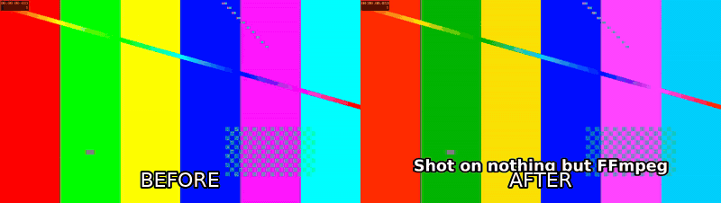

# ffmpeg-skill

**Give your coding agent a video editor.** Local FFmpeg, Python standard library, nothing else.



```bash
npx ffmpeg-skill
```

`ffmpeg-skill` is an [Agent Skill](https://docs.anthropic.com/en/docs/agents-and-tools/agent-skills) for Claude Code, Cursor, Codex and any other agent that reads `SKILL.md`. It teaches the agent a fixed editing workflow (probe → edit losslessly where possible → verify) and ships eight small CLI scripts that do the actual work with `ffmpeg`/`ffprobe`. Think of it as the fully local FFmpeg counterpart to cloud video-agent tools such as browser-use/video-use.

**No API keys. No cloud. No dependencies.** If `ffmpeg` and `python3` are on your PATH, it works — offline, on any footage you'd rather not upload.

## Features

- **Probe first, verify last** — the skill forces the agent to read real duration/fps/resolution before editing and to check the result after, so you get "final.mp4: 59.98 s, 1080×1920, 30 fps" instead of guesses.
- **Lossless when possible** — cuts and joins use stream copy by default; re-encoding only happens when it must (frame-accurate cuts, filters, format changes).
- **Cut & join** segments with `mm:ss` / `hh:mm:ss.ms` times.
- **Declarative edits** — describe the whole edit in a `project.json` (clips, transitions, captions, overlays, music, loudness, export, check) and re-render after every tweak.
- **MCP server** — `mcp/server.py` exposes every script as an MCP tool over stdio (stdlib only) for Claude Desktop, Cursor or any MCP client.
- **Batch / watch folder** — one recipe over a whole shoot with a content-hash cache; re-runs only touch what changed.
- **Optional local transcription** — `caption.py --transcribe` uses whisper.cpp / faster-whisper / openai-whisper when present; never required.
- **Brand kit** — one `brand.json` (fonts, colours, logo, safe margins, caption style) applied by captions, overlays, graphics and projects.
- **Motion graphics without assets** — lower-thirds, title cards, chapter chips, progress bars, countdowns and corner bugs drawn by FFmpeg.
- **HTML delivery report** — before/after contact sheets, media facts, loudness, compliance and the commands run, in one file.
- **Scene detection and highlight picks** — find cuts and loud moments, get a 60-second digest proposal as a cut list.
- **Delivery checks** — PASS/FAIL against YouTube, Shorts, Reels, TikTok, X, LinkedIn, broadcast and podcast specs, with the fix for each failure.
- **Multicam** — align any number of cameras and recorders by audio (with drift correction) and cut between them from a switch list.
- **Real-footage verification kit** — run the whole toolchain on your own device files and get a PASS/FAIL report.
- **Silence removal / jump cuts** — detect dead air, keep a margin around speech, render frame-accurate in one pass; export the cut list for hand editing.
- **Join with transitions** — crossfade, wipes, fade-to-black between mismatched clips (any size, fps, audio layout).
- **Agent eyes** — contact sheets, single frames and before/after comparisons as PNG so the agent verifies caption placement, crops and colour visually.
- **Plan before render** — every script has `--dry-run` (print the ffmpeg commands), `--json` (structured result with a probe of the output), `--fast` (preview quality) and `--progress` (percent / ETA).
- **Captions** — burn SRT/ASS with font, size, colour, outline and position control; generate SRT from a plain timed-text file; animated (fade/pop/slide) and word-by-word karaoke highlight timed to the speech energy in the audio.
- **Fit** to an exact duration (pitch-preserving speed change or trim) and to 16:9 / 9:16 / 1:1 / 4:5 by padding or cropping; motion-interpolated or blended slow motion.
- **Real-world footage handling** — variable-frame-rate phone clips are conformed to constant fps automatically, rotation metadata is honoured, 10-bit HEVC and 5.1 sources are handled.
- **Multicam / external-audio sync** — offset detection by cross-correlation implemented in pure Python (no numpy), 1 ms resolution, plus clock-drift correction for long takes.
- **Colour management** — HDR10 / HLG / Dolby Vision (iPhone) → SDR BT.709 tone mapping, Dolby Vision layer stripping, 3D LUT (.cube) for Log footage and looks, Log-footage detection, metadata-only retagging.
- **Audio post** — voice clean-up chain (highpass, de-esser, FFT denoise, compressor), background music with sidechain ducking, fades, 5.1 → stereo downmix, track replacement.
- **Loudness** — two-pass EBU R128 normalisation to −14 LUFS (or any target) with true-peak ceiling.
- **Overlays** — logos, watermarks and titles with position, time range, opacity and fades.
- **Export presets** — YouTube, Instagram Reels/Shorts/TikTok, X, ProRes 422 HQ master, H.265, GIF — all tagged BT.709.
- **Agent-friendly CLI** — every script has `--help`, prints the output path on stdout, exits non-zero with a reason on stderr, and names outputs `<input>_<operation>.<ext>` by default.

## Install

```bash
# Claude Code (default) → ~/.claude/skills/ffmpeg-skill
npx ffmpeg-skill

# Cursor → ~/.cursor/skills/ffmpeg-skill
npx ffmpeg-skill --cursor

# Codex → ~/.codex/skills/ffmpeg-skill
npx ffmpeg-skill --codex

# everything, or a project-local copy, or a custom directory
npx ffmpeg-skill --all
npx ffmpeg-skill --project
npx ffmpeg-skill --dir ./my-skills
```

Or without Node: clone this repo and copy `SKILL.md` and `scripts/` into your agent's skills directory.

You also need FFmpeg:

| OS | Command |
|----|---------|
| macOS | `brew install ffmpeg` |
| Ubuntu / Debian | `sudo apt install ffmpeg` |
| Windows | `winget install Gyan.FFmpeg` |

## Usage

Once installed, just talk to your agent. Five things you can say to Claude Code:

1. **"Take `interview.mp4`, keep 0:45–3:10 and 5:00–6:30, and make it exactly 60 seconds for Reels."**
   → `probe.py` → `cut.py --segments 0:45-3:10,5:00-6:30` → `fit.py --duration 60 --aspect 9:16 --fit crop` → `export.py --preset reels` → `probe.py` to confirm 60.0 s at 1080×1920.
2. **"Burn these captions in TikTok style, words popping in with a yellow highlight, in Japanese."**
   → `caption.py --text cues.txt --font "Noto Sans CJK JP" --animate pop --karaoke --highlight-color FFD200`.
3. **"The lav mic recording is out of sync with the camera and drifts over the hour — fix it, clean up the hiss and normalise to −14 LUFS."**
   → `sync.py camera.mp4 lav.wav --fix-drift --replace-audio` → `audio.py --voice` → `loudness.py` → report the detected offset, drift ppm and final LUFS.
4. **"Put our logo in the top-right corner for the whole video at 80% opacity, and a title card for the first 4 seconds."**
   → `overlay.py --image logo.png --position top-right --scale 220 --opacity 0.8` → `overlay.py --text "…" --start 0 --end 4 --fade 0.4`.
5. **"This iPhone HDR clip looks washed out on YouTube — fix it and give me a ProRes master too."**
   → `probe.py` (shows `hdr: true`) → `color.py --to-sdr` → `export.py --preset youtube` and `export.py --preset prores`.

The scripts also work on their own:

```bash
python3 ~/.claude/skills/ffmpeg-skill/scripts/probe.py input.mp4 --compact
python3 ~/.claude/skills/ffmpeg-skill/scripts/fit.py input.mp4 --duration 60 --aspect 9:16
```

More examples: [examples/README.md](examples/README.md). To see everything run end-to-end on generated footage: `bash examples/make_demo.sh`.

## Scripts

| Script | What it does |
|--------|--------------|
| `probe.py` | Duration, fps (+ VFR detection), resolution, codecs, bit depth, HDR format incl. Dolby Vision, colour space, rotation, audio channels as JSON; `--analyze` flags Log footage |
| `cut.py` | In/out or multi-segment cuts, lossless `-c copy` first, re-encode fallback, `--accurate` for frame-exact |
| `render.py` | Render a whole edit from `project.json`; `--init`, `--dry-run`, `--stop-after` |
| `batch.py` | Apply a step recipe or render project to a folder, cached, optional watch |
| `mcp/server.py` | MCP server exposing all scripts as tools (stdio JSON-RPC) |
| `graphics.py` | Lower-third, title, chapter, progress, countdown, bug templates (brand colours) |
| `report.py` | Single-file HTML delivery report with sheets, facts, loudness, compliance, commands |
| `scenes.py` | Scene changes, audio peaks, highlight proposals and per-scene sheet |
| `check.py` | Pre-delivery compliance per platform (duration, aspect, codec, colour, loudness, size) |
| `multicam.py` | Align cameras/recorders by audio and switch between them from a time list |
| `verify.py` | Run the toolchain on real device files and report PASS/FAIL per step |
| `silence.py` | Detect and remove silences (jump cuts), list or export the cut list |
| `join.py` | Concatenate clips with xfade transitions, normalising size, fps and audio |
| `look.py` | Contact sheet, single frames, side-by-side comparison as PNG for visual checks |
| `caption.py` | Burn SRT/ASS (font, size, colour, outline, position); build SRT from timed plain text; animated + karaoke ASS |
| `fit.py` | Fit to a duration (speed or trim, smooth slow-mo) and/or aspect ratio (pad or crop), force constant fps |
| `sync.py` | Detect offset between two recordings by audio cross-correlation (1 ms), correct clock drift; output aligned video/audio |
| `color.py` | HDR10/HLG/Dolby Vision → SDR tone mapping, DV layer stripping, 3D LUT application, colour-tag rewriting |
| `audio.py` | Denoise / voice chain, music bed with auto-ducking, fades, downmix, replace track |
| `loudness.py` | Two-pass EBU R128 `loudnorm` to −14 LUFS / −1 dBTP (or custom), video stream-copied |
| `overlay.py` | Composite image/logo or drawtext title with position, time range, opacity, fade |
| `export.py` | Presets: `youtube`, `youtube4k`, `reels`, `x`, `prores`, `h265`, `gif` |

All scripts: Python 3.9+, standard library only, `--help`, non-zero exit + stderr message on failure.

## Measured, not assumed

`tests/corpus.py` downloads public real-device footage (GoPro, DJI, iPhone incl. Dolby Vision, Android screen recordings, HDR10, 24p, Tears of Steel) and runs the toolchain on it; `tests/bench_sync.py`, `bench_silence.py` and `bench_scenes.py` score the algorithms against known ground truth.

| What | Result (0.8.0, local ffmpeg 6.1) |
|---|---|
| Real-device corpus, 10 files | 92 verify steps, all pass after fixes |
| sync.py, ±30 s offsets, gain/noise/EQ, real dialogue+music | 120 s windows (the documented rule): 40/40 within 10 ms, max 1.1 ms. 60 s stress windows: 95 % within 10 ms, 4 of 5 misses flagged by confidence |
| silence.py, 20 cases, known gaps | 0 missed gaps, ≤ 1 ms leftover silence |
| scenes.py, 53 hard cuts between single takes (GoPro/DJI/iPhone/…) | precision 0.95, recall 1.00, F1 0.97 at the default threshold |

```bash
python3 tests/corpus.py --fetch --verify     # ~1.4 GB download, then verify (slow on 4K)
python3 tests/bench_sync.py --cases 100
```

## MCP

```json
{"mcpServers": {"ffmpeg-skill": {"command": "python3", "args": ["/Users/you/.claude/skills/ffmpeg-skill/mcp/server.py"]}}}
```

`python3 mcp/server.py --list` prints the tools; `--call probe '{"inputs": ["a.mp4"]}'` runs one from the shell.

## Requirements

- FFmpeg 5.0+ with `libx264`, `libx265`, `libass`, `prores_ks` and `libzimg` (for `color.py --to-sdr`); the default builds from Homebrew, apt and gyan.dev include all of them
- Python 3.9+
- Node 16+ only for the `npx` installer

## Development

```bash
bash examples/make_demo.sh      # generates footage, runs every script, rebuilds assets/demo.gif
python3 tests/test_all.py       # end-to-end tests incl. VFR, rotated, 5.1, 10-bit HDR10 and drifting sources (needs ffmpeg)
python3 evals/run.py --list     # routing eval prompts (see evals/)
node bin/install.js --dir /tmp/skills   # try the installer without touching ~/.claude
```

## License

[MIT](LICENSE)
