# Demo gallery

Every clip on this page was generated from nothing: ffmpeg's own synthetic sources make the
footage, and each "after" is produced by running one of this repo's scripts on it. Rebuild the
whole page's material with:

```bash
python3 demos/build.py            # or: npm run demo
python3 demos/build.py --list     # what gets built
python3 demos/build.py --only captions_ja
```

The full-resolution `<name>_before.mp4`, `<name>_after.mp4` and side-by-side `<name>.mp4` land
in `demos/out/` (gitignored). Only the small previews below are committed, and the build fails
if any of them exceeds 500 KB.

In every preview the left half is the input and the right half is what the command produced.


## Captions & text

### Burned-in captions (English)

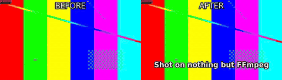

```bash
python3 scripts/caption.py demos/out/fixtures/motion.mp4 --text demos/out/fixtures/cues_en.txt --size 30 --bold --position bottom --margin 40 -o demos/out/captions_en_after.mp4
```

**Look for:** Plain-text cues become an SRT and are rendered by libass -- outline and margin come from the flags, not from a template.

### Japanese captions

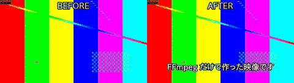

```bash
python3 scripts/caption.py demos/out/fixtures/motion.mp4 --text demos/out/fixtures/cues_ja.txt --size 30 --bold --position bottom --margin 40 -o demos/out/captions_ja_after.mp4
```

**Look for:** The font is chosen per script: Japanese cues get a CJK face automatically, so no box-glyph tofu appears.

### Chinese captions

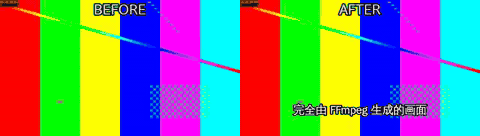

```bash
python3 scripts/caption.py demos/out/fixtures/motion.mp4 --text demos/out/fixtures/cues_zh.txt --size 30 --bold --position bottom --margin 40 -o demos/out/captions_zh_after.mp4
```

**Look for:** Same command, Han text: line breaking and the font switch are handled without a --font flag.

### Korean captions

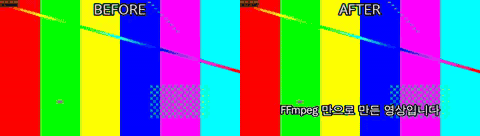

```bash
python3 scripts/caption.py demos/out/fixtures/motion.mp4 --text demos/out/fixtures/cues_ko.txt --size 30 --bold --position bottom --margin 40 -o demos/out/captions_ko_after.mp4
```

**Look for:** Hangul wins script detection even when Latin words are mixed into the same cue.

### Arabic captions

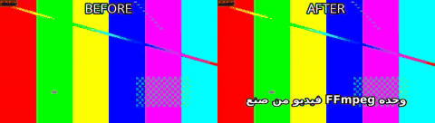

```bash
python3 scripts/caption.py demos/out/fixtures/motion.mp4 --text demos/out/fixtures/cues_ar.txt --size 30 --bold --position bottom --margin 40 -o demos/out/captions_ar_after.mp4
```

**Look for:** Right-to-left text shaped by libass; the Latin fragments inside it stay left-to-right.

### Animated pop captions with karaoke

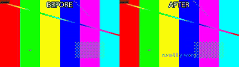

```bash
python3 scripts/caption.py demos/out/fixtures/motion.mp4 --text demos/out/fixtures/cues_pop.txt --size 30 --bold --position bottom --margin 40 --animate pop --karaoke --highlight-color #39ff88 -o demos/out/captions_pop_karaoke_after.mp4
```

**Look for:** Each cue scales in, and the highlight colour walks word by word across the line.

### Lower third

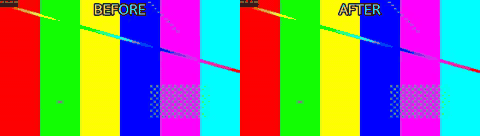

```bash
python3 scripts/graphics.py demos/out/fixtures/motion.mp4 --template lower-third --name 'Ada Lovelace' --title 'Analytical Engine' --start 0.5 --end 5 -o demos/out/lower_third_after.mp4
```

**Look for:** Name and role slide in from the left over the picture and slide out again -- no image asset involved.

### Title card

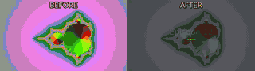

```bash
python3 scripts/graphics.py demos/out/fixtures/mandel.mp4 --template title --title 'Episode 12' --subtitle 'The math of video' --start 0 --end 4 -o demos/out/title_card_after.mp4
```

**Look for:** A centred title and subtitle fade in over the first seconds and leave the rest of the clip untouched.


## Picture

### Logo overlay with fade

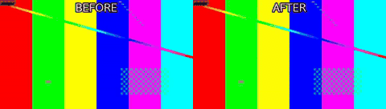

```bash
python3 scripts/overlay.py demos/out/fixtures/motion.mp4 --image demos/out/fixtures/logo.png --position top-right --scale 200 --opacity 0.9 --start 0.5 --end 7.5 --fade 0.6 -o demos/out/logo_overlay_after.mp4
```

**Look for:** The semi-transparent logo fades in at 0.5 s and out before the end; the underlying picture is unchanged.

### HDR10 to SDR

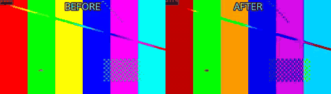

```bash
python3 scripts/color.py demos/out/fixtures/hdr10.mp4 --to-sdr --tonemap hable --preset veryfast -o demos/out/hdr_tonemap_after.mp4
```

**Look for:** The PQ / BT.2020 source is tone-mapped to BT.709: on an SDR screen the 'before' is the washed-out one.

### 16:9 to 9:16 by cropping

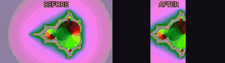

```bash
python3 scripts/fit.py demos/out/fixtures/mandel.mp4 --aspect 9:16 --fit crop --width 540 --preset veryfast -o demos/out/reframe_crop_after.mp4
```

**Look for:** The vertical frame is cut out of the centre of the wide one -- full height, sides lost.

### 16:9 to 9:16 by padding

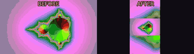

```bash
python3 scripts/fit.py demos/out/fixtures/mandel.mp4 --aspect 9:16 --fit pad --pad-fill blur --width 540 --preset veryfast -o demos/out/reframe_pad_after.mp4
```

**Look for:** Nothing is lost: the wide frame is kept whole and the gap above and below is filled with a blurred copy.

### Speed change to hit a duration


```bash
python3 scripts/fit.py demos/out/fixtures/motion.mp4 --duration 4 --method speed --preset veryfast -o demos/out/speed_up_after.mp4
```

**Look for:** An 8 s clip retimed to land exactly on 4 s; audio is pitch-corrected rather than chipmunked.

### Reverse

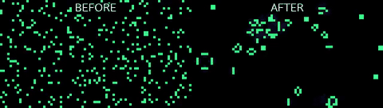

```bash
python3 scripts/reverse.py demos/out/fixtures/life.mp4 --preset veryfast -o demos/out/reverse_after.mp4
```

**Look for:** The life pattern runs backwards -- cells un-die; the audio is reversed with it.

### Join with a cross fade


```bash
python3 scripts/join.py demos/out/fixtures/motion.mp4 demos/out/fixtures/mandel.mp4 --transition fade --duration 0.8 --width 960 --preset veryfast -o demos/out/join_fade_after.mp4
```

**Look for:** Two clips of different content become one; watch the 0.8 s dissolve in the middle.

### Join through black

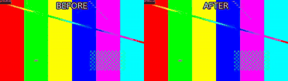

```bash
python3 scripts/join.py demos/out/fixtures/motion.mp4 demos/out/fixtures/mandel.mp4 --transition fadeblack --duration 0.8 --width 960 --preset veryfast -o demos/out/join_fadeblack_after.mp4
```

**Look for:** The same join with fadeblack: the cut dips to black instead of blending the two pictures.


## Audio

### Silence removal

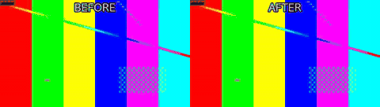

```bash
python3 scripts/silence.py demos/out/fixtures/motion.mp4 --threshold -35 --min-silence 0.4 --margin 0.1 --preset veryfast -o demos/out/silence_removal_after.mp4
```

**Look for:** The 'after' side runs out of material and freezes: that held frame is the part of the timeline that was cut.

### Loudness normalisation to -14 LUFS

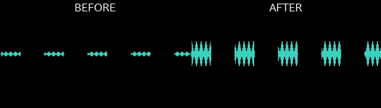

```bash
python3 scripts/loudness.py demos/out/loudness_before.mp4 -I -14 --tp -1 -o demos/out/loudness_after.mp4
```

**Look for:** Two showwavespic plots: the quiet input on the left, the same programme brought up to broadcast level on the right without clipping.

### 5.1 to stereo downmix

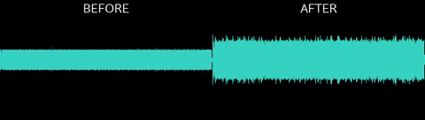

```bash
python3 scripts/audio.py demos/out/fixtures/surround.mp4 --downmix -o demos/out/downmix_51_after.mp4
```

**Look for:** Six discrete tones folded into two channels at the standard coefficients -- the centre and LFE are still audible.

### Music bed with ducking

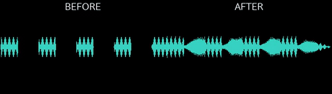

```bash
python3 scripts/audio.py demos/out/fixtures/motion.mp4 --music demos/out/fixtures/music.m4a --duck --duck-amount 12 --music-volume 0.6 --fade-out 1.5 -o demos/out/bgm_ducking_after.mp4
```

**Look for:** The bed drops by 12 dB whenever the speech-like track is active and comes back up in the pauses.


## Delivery & checks

### Reels export, then checked

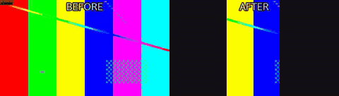

```bash
python3 scripts/export.py demos/out/fixtures/motion.mp4 --preset reels --fit crop -o demos/out/export_reels_after.mp4
python3 scripts/check.py demos/out/export_reels_after.mp4 --platform reels --json
```

**Look for:** One command produces the 1080x1920 deliverable; check.py then reports the spec row by row and exits non-zero on a FAIL.


## Projects & inspection

### Whole edit from one project file

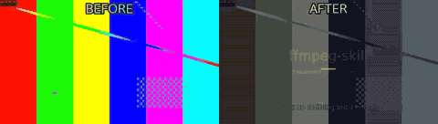

```bash
python3 scripts/render.py demos/out/fixtures/project.json --fast
```

**Look for:** Clips, a transition, captions and a title card described as JSON and rendered in one pass.

### Contact sheet

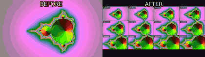

```bash
python3 scripts/look.py demos/out/fixtures/mandel.mp4 --tiles 4x3 --width 960 -o demos/out/contact_sheet_sheet.png
```

**Look for:** Twelve timecoded frames in one PNG: the fastest way to confirm an edit landed where it should.


---

Missing a feature you use? A `feat` PR is expected to add a demo here and in `demos/build.py` -- see [CONTRIBUTING.md](../CONTRIBUTING.md).
