# Demo gallery

Every clip on this page was generated from nothing: ffmpeg's own synthetic sources make the
footage, and each "after" is produced by running one of this repo's scripts on it. Rebuild the
whole page's material with:

```bash
python3 demos/build.py            # or: npm run demo
python3 demos/build.py --list     # what gets built
python3 demos/build.py --only captions_ja
```

The full-resolution `<name>_before.mp4`, `<name>_after.mp4` and side-by-side `<name>.mp4` land
in `demos/out/` (gitignored). Only the small previews below are committed, and the build fails
if any of them exceeds 500 KB.

In every preview the left half is the input and the right half is what the command produced --
except where the burnt-in labels say otherwise, for a demo comparing two settings (a lossless
cut against an accurate one) rather than a before against an after.

The tools at the bottom, under **Inspection**, have no picture: they answer a question instead
of changing one, so the command is the demo.


## Captions & text

### Burned-in captions (English)


```bash
python3 scripts/caption.py demos/out/fixtures/motion.mp4 --text demos/out/fixtures/cues_en.txt --size 30 --bold --position bottom --margin 40 -o demos/out/captions_en_after.mp4
```

**Look for:** Plain-text cues become an SRT and are rendered by libass -- outline and margin come from the flags, not from a template.

### Phrase-aware line breaks

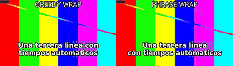

```bash
python3 scripts/caption.py demos/out/fixtures/motion.mp4 --text demos/out/fixtures/cues_phrase.txt --size 34 --bold --position bottom --margin 40 --wrap measured --preset veryfast -o demos/out/captions_phrase_before.mp4
python3 scripts/caption.py demos/out/fixtures/motion.mp4 --text demos/out/fixtures/cues_phrase.txt --size 34 --bold --position bottom --margin 40 --wrap phrase --preset veryfast -o demos/out/captions_phrase_after.mp4
```

**Look for:** The same cue at the same size, with one flag different. Left is 1.15's wrap, which only minimised the widest line and left `the` and `con` stranded at the end of a line; right is 1.16's default, which never breaks inside a word and never ends a line on an article or a preposition. The text itself is untouched -- the skill never rewrites a caption to make it fit.

### Caption size fitted to the cue

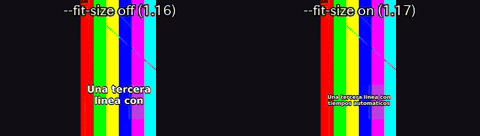

```bash
python3 scripts/caption.py demos/out/fixtures/vertical.mp4 --text demos/out/fixtures/cues_phrase.txt --platform tiktok --max-lines 2 --fit-size off --bold --preset veryfast -o demos/out/captions_fitsize_before.mp4
python3 scripts/caption.py demos/out/fixtures/vertical.mp4 --text demos/out/fixtures/cues_phrase.txt --platform tiktok --max-lines 2 --fit-size on --bold --preset veryfast -o demos/out/captions_fitsize_after.mp4
```

**Look for:** The same cue file at the same destination, with one flag different. Left is 1.16: at the TikTok caption size the cue cannot fit two lines, so it is split into two consecutive cues and half the sentence arrives late. Right is 1.17's default: the size dropped until the whole sentence is on screen at once, and stopped well above the 4.5 %-of-frame-height floor. The text is untouched -- the skill never rewrites a caption to make it fit.

### Three subtitle tracks in one file

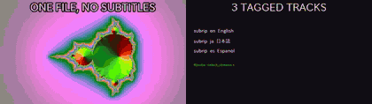

```bash
python3 scripts/caption.py demos/out/fixtures/mandel.mp4 --mode mux --srt demos/out/captions_multitrack_track_en.srt:en --srt demos/out/captions_multitrack_track_ja.srt:ja --srt demos/out/captions_multitrack_track_es.srt:es --default-track en -o demos/out/captions_multitrack_muxed.mkv
```

**Look for:** Nothing is burnt in and nothing is re-encoded: the video and audio are copied bit for bit and three SRTs ride along as toggleable, language-tagged streams. The right half is the track list ffprobe reads back.

### Japanese captions


```bash
python3 scripts/caption.py demos/out/fixtures/motion.mp4 --text demos/out/fixtures/cues_ja.txt --size 30 --bold --position bottom --margin 40 -o demos/out/captions_ja_after.mp4
```

**Look for:** The font is chosen per script: Japanese cues get a CJK face automatically, so no box-glyph tofu appears.

### Chinese captions


```bash
python3 scripts/caption.py demos/out/fixtures/motion.mp4 --text demos/out/fixtures/cues_zh.txt --size 30 --bold --position bottom --margin 40 -o demos/out/captions_zh_after.mp4
```

**Look for:** Same command, Han text: line breaking and the font switch are handled without a --font flag.

### Korean captions


```bash
python3 scripts/caption.py demos/out/fixtures/motion.mp4 --text demos/out/fixtures/cues_ko.txt --size 30 --bold --position bottom --margin 40 -o demos/out/captions_ko_after.mp4
```

**Look for:** Hangul wins script detection even when Latin words are mixed into the same cue.

### Arabic captions


```bash
python3 scripts/caption.py demos/out/fixtures/motion.mp4 --text demos/out/fixtures/cues_ar.txt --size 30 --bold --position bottom --margin 40 -o demos/out/captions_ar_after.mp4
```

**Look for:** Right-to-left text shaped by libass; the Latin fragments inside it stay left-to-right.

### Animated pop captions with karaoke


```bash
python3 scripts/caption.py demos/out/fixtures/motion.mp4 --text demos/out/fixtures/cues_pop.txt --size 30 --bold --position bottom --margin 40 --animate pop --karaoke --highlight-color #39ff88 -o demos/out/captions_pop_karaoke_after.mp4
```

**Look for:** Each cue scales in, and the highlight colour walks word by word across the line.

### Emoji captions in colour

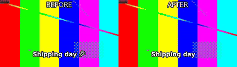

```bash
python3 scripts/caption.py demos/out/fixtures/motion.mp4 --text demos/out/fixtures/cues_emoji.txt --size 30 --bold --margin 40 --emoji mono -o demos/out/captions_emoji_before.mp4
python3 scripts/caption.py demos/out/fixtures/motion.mp4 --text demos/out/fixtures/cues_emoji.txt --size 30 --bold --margin 40 --emoji-assets demos/out/fixtures/emoji -o demos/out/captions_emoji_after.mp4
```

**Look for:** Left: emoji as this ffmpeg's libass draws them (monochrome, or missing). Right: one PNG per emoji cluster composited over the caption, with the ASS reserving the exact gap -- the text does not move.

### Hindi lower third, shaped

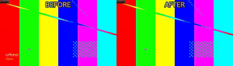

```bash
python3 scripts/graphics.py demos/out/fixtures/motion.mp4 --template lower-third --name 'प्रिया शर्मा' --title निर्देशक --start 0.5 --end 5 --text-render ass -o demos/out/lower_third_hindi_after.mp4
```

**Look for:** Left: the same text through drawtext -- the i-matra is not reordered and the final matra is dropped. Right: graphics.py routing Devanagari through libass automatically. drawtext does not use harfbuzz on any build.

### Lower third


```bash
python3 scripts/graphics.py demos/out/fixtures/motion.mp4 --template lower-third --name 'Ada Lovelace' --title 'Analytical Engine' --start 0.5 --end 5 -o demos/out/lower_third_after.mp4
```

**Look for:** Name and role slide in from the left over the picture and slide out again -- no image asset involved.

### Title card


```bash
python3 scripts/graphics.py demos/out/fixtures/mandel.mp4 --template title --title 'Episode 12' --subtitle 'The math of video' --start 0 --end 4 -o demos/out/title_card_after.mp4
```

**Look for:** A centred title and subtitle fade in over the first seconds and leave the rest of the clip untouched.


## Picture

### Logo overlay with fade


```bash
python3 scripts/overlay.py demos/out/fixtures/motion.mp4 --image demos/out/fixtures/logo.png --position top-right --scale 200 --opacity 0.9 --start 0.5 --end 7.5 --fade 0.6 -o demos/out/logo_overlay_after.mp4
```

**Look for:** The semi-transparent logo fades in at 0.5 s and out before the end; the underlying picture is unchanged.

### HDR10 to SDR


```bash
python3 scripts/color.py demos/out/fixtures/hdr10.mp4 --to-sdr --tonemap hable --preset veryfast -o demos/out/hdr_tonemap_after.mp4
```

**Look for:** The PQ / BT.2020 source is tone-mapped to BT.709: on an SDR screen the 'before' is the washed-out one.

### 16:9 to 9:16 by cropping


```bash
python3 scripts/fit.py demos/out/fixtures/mandel.mp4 --aspect 9:16 --fit crop --width 540 --preset veryfast -o demos/out/reframe_crop_after.mp4
```

**Look for:** The vertical frame is cut out of the centre of the wide one -- full height, sides lost.

### 16:9 to 9:16 by padding


```bash
python3 scripts/fit.py demos/out/fixtures/mandel.mp4 --aspect 9:16 --fit pad --pad-fill blur --width 540 --preset veryfast -o demos/out/reframe_pad_after.mp4
```

**Look for:** Nothing is lost: the wide frame is kept whole and the gap above and below is filled with a blurred copy.

### Speed change to hit a duration


```bash
python3 scripts/fit.py demos/out/fixtures/motion.mp4 --duration 4 --method speed --preset veryfast -o demos/out/speed_up_after.mp4
```

**Look for:** An 8 s clip retimed to land exactly on 4 s; audio is pitch-corrected rather than chipmunked.

### Reverse


```bash
python3 scripts/reverse.py demos/out/fixtures/life.mp4 --preset veryfast -o demos/out/reverse_after.mp4
```

**Look for:** The life pattern runs backwards -- cells un-die; the audio is reversed with it.

### Join with a cross fade


```bash
python3 scripts/join.py demos/out/fixtures/motion.mp4 demos/out/fixtures/mandel.mp4 --transition fade --duration 0.8 --width 960 --preset veryfast -o demos/out/join_fade_after.mp4
```

**Look for:** Two clips of different content become one; watch the 0.8 s dissolve in the middle.

### Join through black


```bash
python3 scripts/join.py demos/out/fixtures/motion.mp4 demos/out/fixtures/mandel.mp4 --transition fadeblack --duration 0.8 --width 960 --preset veryfast -o demos/out/join_fadeblack_after.mp4
```

**Look for:** The same join with fadeblack: the cut dips to black instead of blending the two pictures.

### 16:9 to 9:16 on a blurred background

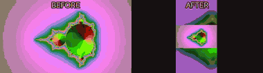

```bash
python3 scripts/fit.py demos/out/fixtures/mandel.mp4 --aspect 9:16 --fit blur --width 540 --preset veryfast -o demos/out/fit_blur_after.mp4
```

**Look for:** Nothing is cropped and there are no black bars: the whole wide frame sits centred on a blurred, dimmed copy of itself.

### Lossless cut vs. accurate cut

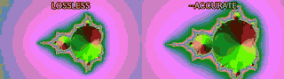

```bash
python3 scripts/cut.py demos/out/fixtures/mandel.mp4 --start 2.05 --duration 3 --tolerance 5 --json -o demos/out/cut_accurate_before.mp4
python3 scripts/cut.py demos/out/fixtures/mandel.mp4 --start 2.05 --duration 3 --accurate --preset veryfast -o demos/out/cut_accurate_after.mp4
```

**Look for:** Both sides asked for the same 2.05 s start. The stream copy could only snap to the nearest keyframe, so its first frame is from earlier in the clip; --accurate re-encodes and starts on the frame that was asked for.

### Cuts that land on the beat

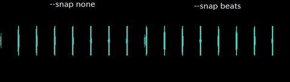

```bash
python3 scripts/cut.py demos/out/fixtures/clicks.mp4 --start 2.03 --end 6.01 --snap none --accurate --preset veryfast -o demos/out/beats_snap_before.mp4
python3 scripts/cut.py demos/out/fixtures/clicks.mp4 --start 2.03 --end 6.01 --snap beats --accurate --preset veryfast -o demos/out/beats_snap_after.mp4
```

**Look for:** Both cuts asked for 2.03 s. The right one moved 30 ms to the nearest measured onset, so its first frame lands on a click instead of just after one; the waveform is the evidence. The tempo, the beat list and the confidence are in the JSON -- nothing is snapped to a grid the audio does not support, and below --min-confidence the cut refuses rather than inventing one.

### Crop to an exact rectangle

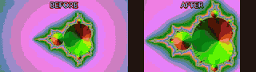

```bash
python3 scripts/crop.py demos/out/fixtures/mandel.mp4 --x 320 --y 120 --width 640 --height 480 --preset veryfast -o demos/out/crop_rect_after.mp4
```

**Look for:** A literal 640x480 window at x=320, y=120 in the source frame -- no aspect maths, no auto-centring; the rectangle is the caller's and is refused rather than rounded if it does not fit.

### Detect letterbox bars, then remove them

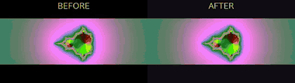

```bash
python3 scripts/cropdetect.py demos/out/fixtures/letterbox.mp4 --seconds 4 --json
python3 scripts/crop.py demos/out/fixtures/letterbox.mp4 --x 0 --y 160 --width 1280 --height 400 --preset veryfast -o demos/out/cropdetect_crop_after.mp4
```

**Look for:** cropdetect.py measures the bars and prints the rectangle; crop.py is what actually cuts them off. Measuring and deciding stay two commands.

### Pad the timeline with black

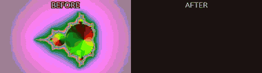

```bash
python3 scripts/pad.py demos/out/fixtures/mandel.mp4 --start 1 --end 1 --color 0x101014 --preset veryfast -o demos/out/pad_timeline_after.mp4
```

**Look for:** A second of black and silence before and after the clip -- the TIMELINE grows, the frame does not (that is fit.py --fit pad).

### Freeze frame under a title

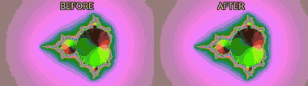

```bash
python3 scripts/graphics.py demos/out/fixtures/mandel.mp4 --template title --title 'Hold this frame' --subtitle 'freeze.py --at 2 --hold 1.5' --start 1.6 --end 4 -o demos/out/freeze_hold_titled.mp4
python3 scripts/freeze.py demos/out/freeze_hold_titled.mp4 --at 2 --hold 1.5 --preset veryfast -o demos/out/freeze_hold_after.mp4
```

**Look for:** The clip stops dead at 2 s for a beat and a half while the title card sits over it, then carries on -- everything after the freeze is pushed later, nothing is lost.

### Loop a short clip

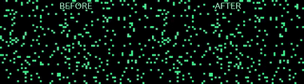

```bash
python3 scripts/cut.py demos/out/fixtures/life.mp4 --start 0 --duration 1.5 --accurate --preset veryfast -o demos/out/loop_times_before.mp4
python3 scripts/loop.py demos/out/loop_times_before.mp4 --times 4 --preset veryfast -o demos/out/loop_times_after.mp4
```

**Look for:** A 1.5 s clip repeated four times back to back. The seam is not smoothed: a clip that does not already loop cleanly shows its cut, which is a judgement about the material, not a flag.

### A still card dropped into the timeline

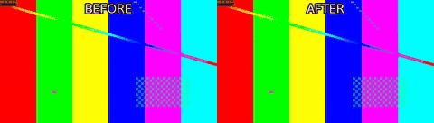

```bash
python3 scripts/insert.py demos/out/fixtures/slate.png --duration 2 --width 960 --height 540 --fps 25 --zoom in --pan right --preset veryfast -o demos/out/insert_still_card.mp4
python3 scripts/join.py demos/out/fixtures/motion.mp4 demos/out/insert_still_card.mp4 demos/out/fixtures/mandel.mp4 --transition fade --duration 0.5 --width 960 --height 540 --fps 25 --preset veryfast -o demos/out/insert_still_after.mp4
```

**Look for:** insert.py turns one PNG into a 2 s clip with a slow zoom and pan, and join.py cross-fades it in between the two shots.

### Numbered stills into a clip

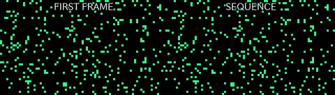

```bash
python3 scripts/sequence.py --dir demos/out/fixtures/frames --pattern frame_%04d.png --start-number 1 --fps 8 --preset veryfast -o demos/out/sequence_frames_after.mp4
```

**Look for:** Twenty-four PNGs named frame_0001.png onwards become one 8 fps clip; the frame list is resolved and checked on disk before ffmpeg is asked to read it.

### Speed ramp

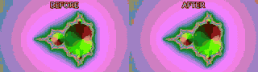

```bash
python3 scripts/speedramp.py demos/out/fixtures/mandel.mp4 --segment 0-2:2.0 --segment 2-3:0.35 --segment 3-6:1.5 --preset veryfast -o demos/out/speedramp_after.mp4
```

**Look for:** Three constant-speed segments in one pass: 2x, then a 0.35x slam for the beat, then 1.5x out. Audio is pitch-corrected through all three.

### Denoise

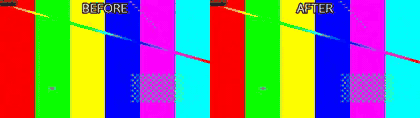

```bash
python3 scripts/denoise.py demos/out/fixtures/noisy.mp4 --strength high --preset veryfast -o demos/out/denoise_after.mp4
```

**Look for:** hqdn3d at --strength high takes the grain out; look closely and the fine detail softens with it, which is the trade the flag is making.

### Deinterlace

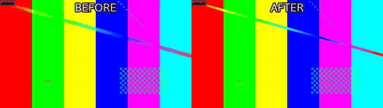

```bash
python3 scripts/deinterlace.py demos/out/fixtures/interlaced.mp4 --mode frame --parity tff --preset veryfast -o demos/out/deinterlace_after.mp4
```

**Look for:** The combing on moving edges -- alternate lines from two different moments -- is woven back into whole progressive frames by yadif.

### Stabilize shaky footage

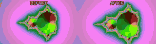

```bash
python3 scripts/stabilize.py demos/out/fixtures/shaky.mp4 --shakiness 8 --smoothing 20 --zoom 5 --preset veryfast -o demos/out/stabilize_after.mp4
```

**Look for:** vidstab's two passes cancel the handheld jitter and crop in 5% to hide the edges that smoothing exposes; the frame stops wandering.

### Straighten a tilted horizon

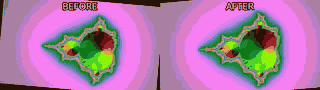

```bash
python3 scripts/straighten.py demos/out/fixtures/tilted.mp4 --degrees -5 --fit crop --preset veryfast -o demos/out/straighten_after.mp4
```

**Look for:** A 5 degree tilt taken back out. --fit crop scales up just enough that the rotated corners leave no gap, costing a thin border of picture.

### Redact a rectangle

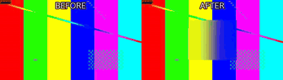

```bash
python3 scripts/redact.py demos/out/fixtures/motion.mp4 --x 420 --y 180 --width 440 --height 360 --mode blur --blur-strength 24 --preset veryfast -o demos/out/redact_blur_after.mp4
```

**Look for:** One region blurred for the whole clip and the rest of the frame untouched. The rectangle has to be given: this tool finds no faces and no plates.

### 360 panorama to a flat view

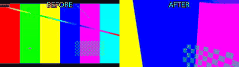

```bash
python3 scripts/sphere.py demos/out/fixtures/equirect.mp4 --input-projection equirect --yaw 40 --pitch -10 --h-fov 100 --v-fov 70 --width 960 --height 540 --preset veryfast -o demos/out/sphere_flat_after.mp4
```

**Look for:** v360 maps the 2:1 equirectangular source onto a rectilinear camera pointed 40 degrees right and 10 degrees down -- the same viewport a headset would show, baked into a file.

### Green screen onto a generated background

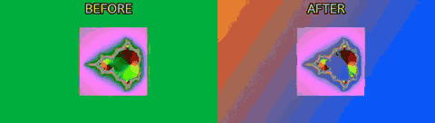

```bash
python3 scripts/background.py --duration 4 --width 960 --height 540 --gradient 0xff6a00:0x0057ff --angle 45 --fps 25 --preset veryfast -o demos/out/greenscreen_plate.mp4
python3 scripts/overlay.py demos/out/greenscreen_plate.mp4 --video demos/out/fixtures/green.mp4 --chromakey 0x00b140 --chromakey-similarity 0.18 --chromakey-blend 0.05 --position center --scale 960 --preset veryfast -o demos/out/greenscreen_after.mp4
```

**Look for:** background.py draws the gradient plate from nothing (there is no input file), then overlay.py keys the chroma green out of the subject and composites it on top.

### Apply a .cube LUT

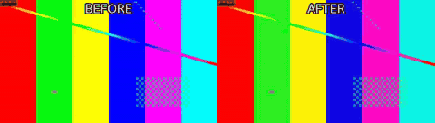

```bash
python3 scripts/color.py demos/out/fixtures/motion.mp4 --lut demos/out/fixtures/look.cube --lut-strength 1.0 --preset veryfast -o demos/out/color_lut_after.mp4
```

**Look for:** A 3D LUT applied at full strength: highlights warm, shadows cool. The same flag takes a camera vendor's Log-to-709 transform or a creative look -- the file decides, the tool does not.

### Primary colour correction

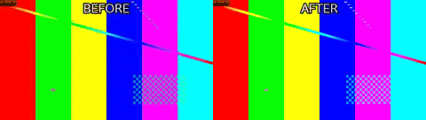

```bash
python3 scripts/color.py demos/out/fixtures/motion.mp4 --correct --exposure 0.25 --contrast 1.25 --saturation 1.3 --temperature 7000 --gamma 1.1 --preset veryfast -o demos/out/color_correct_after.mp4
```

**Look for:** Typed values, not a look: exposure +0.25, contrast 1.25, saturation 1.3, white balance to 7000 K, gamma 1.1 -- each one a number the caller chose.

### 2x2 comparison grid

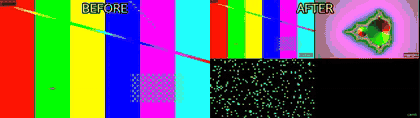

```bash
python3 scripts/grid.py demos/out/fixtures/motion.mp4 demos/out/fixtures/mandel.mp4 demos/out/fixtures/life.mp4 demos/out/fixtures/camb.mp4 --cols 2 --rows 2 --cell-width 480 --cell-height 270 --fps 25 --audio-from 0 --gap 4 --preset veryfast -o demos/out/grid_2x2_after.mp4
```

**Look for:** Four clips of different content in one frame, each letterboxed into its cell rather than stretched, with the source name burnt into the corner and only input 0's audio carried through.

### B-roll cutaway

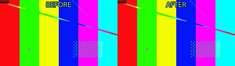

```bash
python3 scripts/broll.py demos/out/fixtures/motion.mp4 --insert demos/out/fixtures/mandel.mp4 --at 2 --duration 3 --audio a --preset veryfast -o demos/out/broll_cutaway_after.mp4
```

**Look for:** From 2 s to 5 s the picture cuts away to the insert while the interview audio keeps running underneath, then comes back at its own time -- the output is exactly as long as the A-roll.

### Two cameras, one cut list

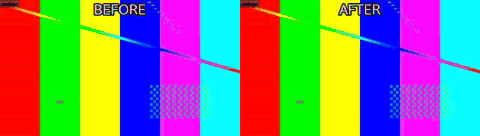

```bash
python3 scripts/multicam.py demos/out/fixtures/motion.mp4 demos/out/fixtures/camb.mp4 --switch 0-2:0,2-4:1,4-6:0 --width 960 --height 540 --fps 25 --preset veryfast -o demos/out/multicam_switch_after.mp4
```

**Look for:** Camera B's audio is the same event 0.6 s offset; multicam.py measures that by cross-correlation, aligns both, then cuts between them on the ranges it was given.

### Crop centred on the measured motion

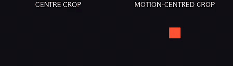

```bash
python3 scripts/cropdetect.py demos/out/motion_centre_crop_offcentre.mp4 --motion-centre --json
python3 scripts/crop.py demos/out/motion_centre_crop_offcentre.mp4 --x 328 --y 0 --width 304 --height 540 --preset veryfast -o demos/out/motion_centre_crop_centre.mp4
python3 scripts/crop.py demos/out/motion_centre_crop_offcentre.mp4 --x 632 --y 0 --width 304 --height 540 --preset veryfast -o demos/out/motion_centre_crop_after.mp4
```

**Look for:** cropdetect.py --motion-centre reports where the motion sits per second; it never picks a reframe itself. Left is a naive centre crop that clips the moving subject sitting off to one side; right is crop.py aimed at the measured centroid instead.

### Auto-switch to whichever camera is loudest

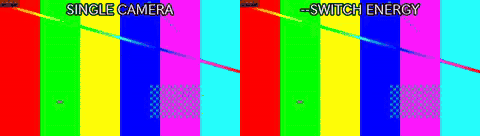

```bash
python3 scripts/multicam.py demos/out/fixtures/motion.mp4 demos/out/fixtures/camb.mp4 --switch 0-6:0 --width 960 --height 540 --fps 25 --preset veryfast -o demos/out/multicam_switch_energy_single_cam.mp4
python3 scripts/multicam.py demos/out/fixtures/motion.mp4 demos/out/fixtures/camb.mp4 --switch energy --min-shot 1 --width 960 --height 540 --fps 25 --preset veryfast -o demos/out/multicam_switch_energy_after.mp4
```

**Look for:** The literal 'energy' switch list auto-cuts to whichever of the two cameras is loudest at each moment, respecting --min-shot; left is a fixed single-camera cut for contrast.


## Audio

### Silence removal


```bash
python3 scripts/silence.py demos/out/fixtures/motion.mp4 --threshold -35 --min-silence 0.4 --margin 0.1 --preset veryfast -o demos/out/silence_removal_after.mp4
```

**Look for:** The 'after' side runs out of material and freezes: that held frame is the part of the timeline that was cut.

### Loudness normalisation to -14 LUFS


```bash
python3 scripts/loudness.py demos/out/loudness_before.mp4 -I -14 --tp -1 -o demos/out/loudness_after.mp4
```

**Look for:** Two showwavespic plots: the quiet input on the left, the same programme brought up to broadcast level on the right without clipping.

### 5.1 to stereo downmix


```bash
python3 scripts/audio.py demos/out/fixtures/surround.mp4 --downmix -o demos/out/downmix_51_after.mp4
```

**Look for:** Six discrete tones folded into two channels at the standard coefficients -- the centre and LFE are still audible.

### Music bed with ducking


```bash
python3 scripts/audio.py demos/out/fixtures/motion.mp4 --music demos/out/fixtures/music.m4a --duck --duck-amount 12 --music-volume 0.6 --fade-out 1.5 -o demos/out/bgm_ducking_after.mp4
```

**Look for:** The bed drops by 12 dB whenever the speech-like track is active and comes back up in the pauses.

### External mic aligned to the camera

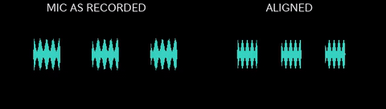

```bash
python3 scripts/sync.py demos/out/fixtures/motion.mp4 demos/out/fixtures/mic.wav --replace-audio --json -o demos/out/sync_mic_after.mp4
```

**Look for:** The mic was started after the camera, so its envelope begins late in its own file; after the sync the same speech sits where the camera's does. Left is the mic as recorded, right is the track that ends up on the picture -- the measured offset and its confidence are printed by the command.

### Audio rendered as a waveform video

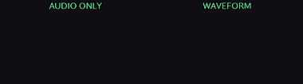

```bash
python3 scripts/waveform.py demos/out/fixtures/music.m4a --style waveform --width 960 --height 540 --color 0x39ff88 --background 0x101014 --waveform-mode cline --preset veryfast -o demos/out/waveform_render_after.mp4
```

**Look for:** An audio-only file has nothing to show; showwaves draws the amplitude as it plays, and the rendered clip carries the same audio it is drawing.

### Audio episode as a shareable audiogram

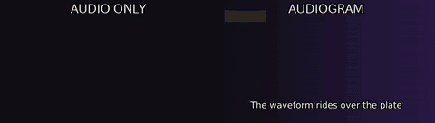

```bash
python3 scripts/background.py --width 960 --height 540 --gradient #101014:#2a1846 --duration 1 -o demos/out/audiogram_plate.mp4
python3 scripts/waveform.py demos/out/fixtures/music.m4a --image demos/out/audiogram_plate.png --width 960 --height 540 --position strip --vis-height 0.3 --color 0x39ff88 --title 'Episode 12' --text demos/out/audiogram_cues.txt --preset veryfast -o demos/out/audiogram_after.mp4
```

**Look for:** The same track as the waveform demo, this time over a still plate with the episode title and burnt-in captions -- one waveform.py --image call (or render.py --template audiogram). The picture is generated by background.py: nothing was downloaded and no cover art was invented.

### Speech-aware silence removal keeps the breaths

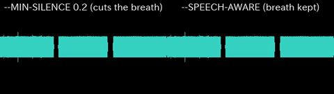

```bash
python3 scripts/silence.py demos/out/silence_speech_aware_breathy.mp4 --threshold -35 --min-silence 0.2 --margin 0.1 --list --json
python3 scripts/silence.py demos/out/silence_speech_aware_breathy.mp4 --threshold -35 --min-silence 0.2 --margin 0.1 --preset veryfast -o demos/out/silence_speech_aware_naive.mp4
python3 scripts/silence.py demos/out/silence_speech_aware_breathy.mp4 --threshold -35 --min-silence 0.6 --speech-aware --list --json
python3 scripts/silence.py demos/out/silence_speech_aware_breathy.mp4 --threshold -35 --min-silence 0.6 --speech-aware --preset veryfast -o demos/out/silence_speech_aware_after.mp4
```

**Look for:** A 0.25 s breath sits inside a sentence and a 1 s pause sits between sentences. Left uses a --min-silence low enough to catch the breath too, so plain detection cuts both; right is --speech-aware at the ordinary --min-silence -- its finer 0.12 s floor still measures the breath, but the breath is shorter than --min-silence so it is kept, and only the real sentence-boundary pause is cut.


## Delivery & checks

### Reels export, then checked


```bash
python3 scripts/export.py demos/out/fixtures/motion.mp4 --preset reels --fit crop -o demos/out/export_reels_after.mp4
python3 scripts/check.py demos/out/export_reels_after.mp4 --platform reels --json
```

**Look for:** One command produces the 1080x1920 deliverable; check.py then reports the spec row by row and exits non-zero on a FAIL.

### TikTok delivery template

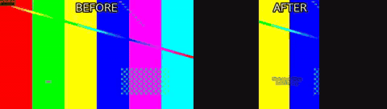

```bash
python3 scripts/render.py demos/out/fixtures/motion.mp4 --template tiktok --cues demos/out/fixtures/cues_en.txt --fast -o demos/out/template_tiktok_after.mp4
```

**Look for:** One command turns the master into the 1080x1920 deliverable: reframe, burned-in captions kept clear of TikTok's own UI, loudness to -14 LUFS, the tiktok export preset and check.py's platform rows.

### Proxy vs. master, shown at the same size

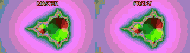

```bash
python3 scripts/proxy.py demos/out/fixtures/mandel.mp4 --width 320 --crf 34 --fps 12 -o demos/out/proxy_after.mp4
```

**Look for:** Both halves are scaled to the same cell, which is the honest comparison: the proxy is smaller on disk and cheaper to decode, not smaller on screen. The softness is the point of it.


## Projects & inspection

### Whole edit from one project file


```bash
python3 scripts/render.py demos/out/fixtures/project.json --fast
```

**Look for:** Clips, a transition, captions and a title card described as JSON and rendered in one pass.

### Contact sheet


```bash
python3 scripts/look.py demos/out/fixtures/mandel.mp4 --tiles 4x3 --width 960 -o demos/out/contact_sheet_sheet.png
```

**Look for:** Twelve timecoded frames in one PNG: the fastest way to confirm an edit landed where it should.

### Scene detection into a highlight reel

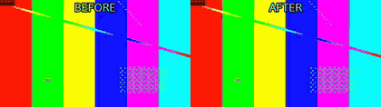

```bash
python3 scripts/scenes.py demos/out/fixtures/shots.mp4 --highlights 2 --min-scene 1 --edl demos/out/scenes_highlights_picks.txt
python3 scripts/cut.py demos/out/fixtures/shots.mp4 --segments 0.00-1.50,4.00-5.50 --accurate --preset veryfast -o demos/out/scenes_highlights_after.mp4
```

**Look for:** scdet finds the hard cuts, scenes.py ranks the scenes and writes the ranges as an EDL, and cut.py --segments is what turns that proposal into a reel. The ranking is a proxy for interest, not a judgement of it.

### Chapter marks written into the container

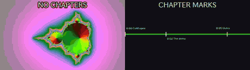

```bash
python3 scripts/metadata.py demos/out/fixtures/mandel.mp4 --chapters demos/out/fixtures/chapters.txt --title 'Demo episode' -o demos/out/metadata_chapters_tagged.mp4
```

**Look for:** Nothing in the picture changes -- every stream is copied bit for bit. The right half is the chapter list read back out of the file with ffprobe and drawn as the timeline strip a player would show.

### Chapters proposed from measured structure

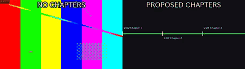

```bash
python3 scripts/metadata.py demos/out/fixtures/shots.mp4 --auto-chapters --min-chapter 1 --from scenes -o demos/out/metadata_auto_chapters_auto.mp4
```

**Look for:** The left strip is the file with no markers; the right is the same file after --auto-chapters, whose timestamps come from the measured pauses and scene cuts and whose titles are deliberately 'Chapter 1..N' -- the skill proposes where, the caller says what.

### Shots labelled static / pan / motion

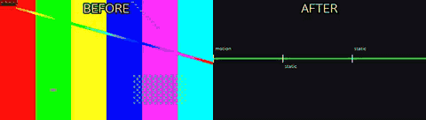

```bash
python3 scripts/scenes.py demos/out/fixtures/shots.mp4 --shots --json
```

**Look for:** scenes.py --shots measures an optical-flow proxy per detected shot and reports a label for each -- a measurement, not an edit. The strip shows the three shots in the fixture with the labels actually returned.


## Inspection

These tools answer a question instead of changing a picture, so there is
nothing to put a before and an after next to. Each one prints a table, a JSON document or writes
an HTML file; the command is the demo.

### probe.py

```bash
python3 scripts/probe.py demos/out/render_project_after.mp4 --compact
```

**No picture:** duration, fps and VFR suspicion, frame size, codecs, pixel format and colour tags, audio channels and sample rate -- one JSON document, or one line per file with --compact.

### verify.py

```bash
python3 scripts/verify.py ~/Footage --quick --report verify.md
```

**No picture:** runs the whole toolchain over your own files and prints a PASS/FAIL table, one row per tool per file. Synthetic fixtures cannot show what a real phone container does; this can.

### batch.py

```bash
python3 scripts/batch.py ~/Footage --recipe batch.json --dry-run
```

**No picture:** applies one recipe to a folder with a content-hash cache, printing what it would run, what it skipped as unchanged, and where each output lands.

### report.py

```bash
python3 scripts/report.py --before raw.mov --after final.mp4 -o report.html
```

**No picture:** a single self-contained HTML page: before/after contact sheets, loudness, the platform check table and the exact commands. It is a file to open, not a picture to embed here.


---

Missing a feature you use? A `feat` PR is expected to add a demo here and in `demos/build.py` -- see [CONTRIBUTING.md](../CONTRIBUTING.md).
